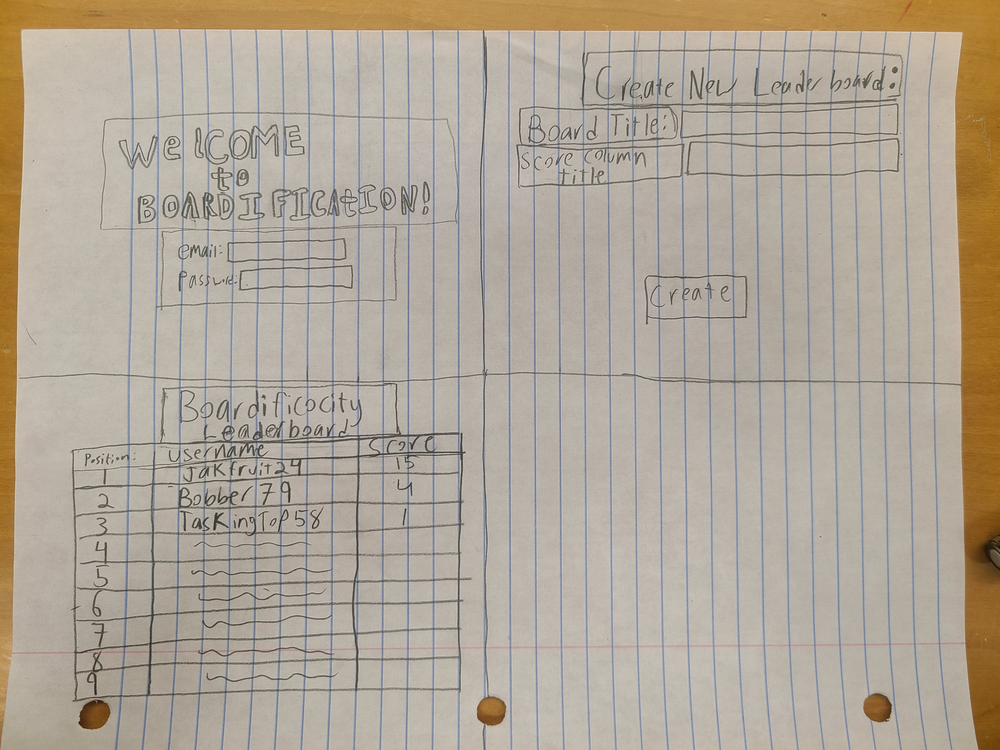
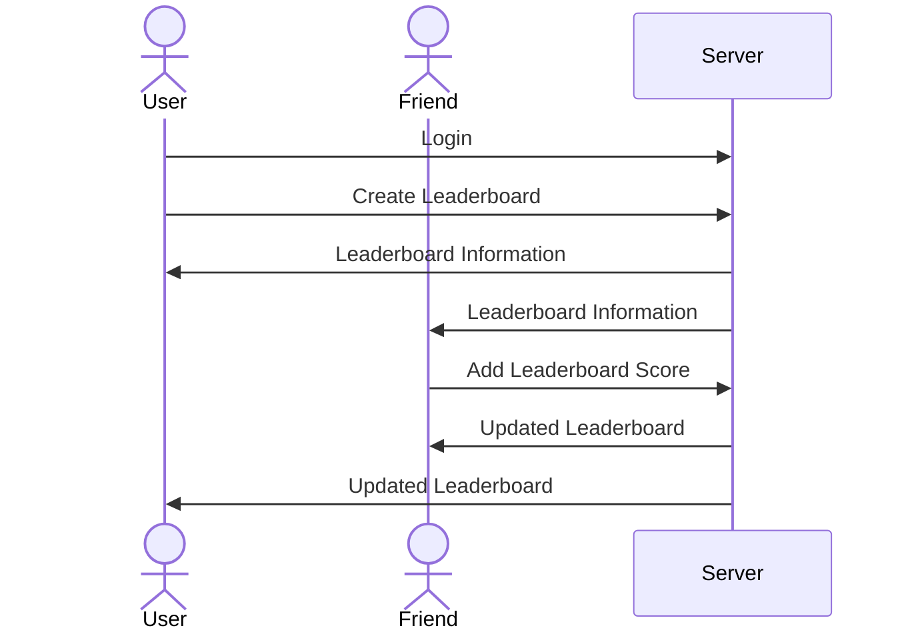

# Boardification

[My Notes](notes.md)

A simple web application to turn anything quantifiable into a contest. Leaderboards can be created, titled, and have scores submitted to them by users. Boards can be opened and closed by users, and can be seen by anyone invited to the same board.

## 🚀 Specification Deliverable

For this deliverable I did the following. I checked the box `[x]` and added a description for things I completed.

- [x] Proper use of Markdown
- [x] A concise and compelling elevator pitch
- [x] Description of key features
- [x] Description of how you will use each technology
- [x] One or more rough sketches of your application. Images must be embedded in this file using Markdown image references.

### Elevator pitch

Have you ever needed a place to keep track of your competition with all your friends? Boardification is the answer. On Boardification, you can create a leader board (or "boardify") for anything you can think of. Most cookies made in a day? Highest streak of wins in Chess? Number of leaderboards won? Boardify has you covered. Just sign up for an account, boardify your contest, and invite your friends to join the board. Now it's easy to see who's #1.

### Design

A diagram showing a basic interaction with the site. A user creates a leaderboard and the server gives both the user and the friend the leaderboard. The friend inputs a score. The server then updates the leaderboard for both the user and the friend.

```mermaid
sequenceDiagram
    actor User
    actor Friend
    User->>Server: Login
    User->>Server: Create Leaderboard
    Server->>User: Leaderboard Information
    Server->>Friend: Leaderboard Information
    Friend->>Server: Add Leaderboard Score
    Server->>Friend: Updated Leaderboard
    Server->>User: Updated Leaderboard
```

### Key features

- Ability to log in securely via HTTPS
- Ability to create leaderboards
- Ability to submit scores to leaderboards
- Ability to invite others with accounts to join leaderboards
- Leaderboards stored and updated

### Technologies

I am going to use the required technologies in the following ways.

- **HTML** - Three different pages will be made with HTML: login, create leaderboard, view leaderboard
- **CSS** - CSS will be used to make viewing the site pleasant with a good color scheme and images where needed.
- **React** - Will be used to allow logging in, creating leaderboards, submitting scores, and other user inputs.
- **Service** - Will be used for:
    - User login and fetching login information
    - Storing and updating created leaderboards and submitted scores
    - Retrieving leaderboard information
- **DB/Login** - Login information, user information, leaderboard data, etc stored in DB.
- **WebSocket** - Leaderboards updated in real time with WebSocket.

## 🚀 AWS deliverable

For this deliverable I did the following. I checked the box `[x]` and added a description for things I completed.

- [x] **Server deployed and accessible with custom domain name** - [My server link](https://boardification.click).

## 🚀 HTML deliverable

For this deliverable I did the following. I checked the box `[x]` and added a description for things I completed.

- [x] **HTML pages** - I created four pages: index.html, which contains the login portal; create.html, which will be the tool for creating leaderboards; myboards.html, which will contain the updating leaderboards the user has created; and about.html, which contains information about the application.
- [x] **Proper HTML element usage** - I followed the conventions I saw in the examples, and I believe it is proper usage.
- [x] **Links** - In the footer of each page, I included a link to my github repository. Additionally, at the top of each page I put a site map, containing links to all the other pages on the site.
- [X] **Text** - Text is displayed on all pages, but it 
- [x] **3rd party API placeholder** - On the about.html page, it has an inspirational quote. Since I can't think of any other good 3rd party API uses yet, for now I have a placeholder for an inspirational quote to help users feel motivated to win their leaderboards.
- [x] **Images** - I designed a rough banner (that just says "boardification") and I applied it to the top of all pages. It is called board_logo.png.
- [x] **Login placeholder** - In index.html, there is a login placeholder, with options for creating an account, or logging in with an email and password.
- [x] **DB data placeholder** - In myboards.html, I made a set of tables that are examples of the leaderboards, which will be a large part of what I will be using the DB for.
- [x] **WebSocket placeholder** - I put in a placeholder for creating leaderboards, and then the plan is for the leaderboards to update whenever someone submits a score to them. Each leader board has a field to submit a score to that board, which will then update for all other users.

## 🚀 CSS deliverable

For this deliverable I did the following. I checked the box `[x]` and added a description for things I completed.

- [x] **Visually appealing colors and layout. No overflowing elements.** - I made sure that elements did not overflow, and I made sure that the colors looked appealing. I went with a nice dark blue, gray, and white color scheme. I think it looks nice.
- [x] **Use of a CSS framework** - I made use of Bootstrap buttons, text-entry boxes, tables, and a navigation bar. Bootstrap buttons and text-entry boxes are a prominent feature of the "home" page, the "Create a Board" page, and the "My Boards" page. The navigation bar is clearly seen clearly at the top of every page. The tables are shown on the My Boards page.
- [x] **All visual elements styled using CSS** - Everything is at least styled with a font and color change via CSS. Flexboxes and various other styling tools are used to center or otherwise style all the elements.
- [x] **Responsive to window resizing using flexbox and/or grid display** - I use flexboxes for a lot of things all over the site. At the bottom of each css file, I have an @media section to get rid of the navigation bar if the window is too small.
- [x] **Use of a imported font** - I imported the Roboto Condensed font from Google and applied it to all my pages.
- [x] **Use of different types of selectors including element, class, ID, and pseudo selectors** - I make use of element and class selectors liberally on each page. On the about page, where I am working with more specific paragraphs to format, I use a lot of ID selectors. I also make use of the pseudo selector "hover" on that page, which colors the background of what will be the 3rd party quote supplier black.

## 🚀 React part 1: Routing deliverable

For this deliverable I did the following. I checked the box `[x]` and added a description for things I completed.

- [x] **Bundled using Vite** - I did indeed bundle it with vite, and I made liberal use of the live view/stream feature while I was putting this deliverable together.
- [x] **Components** - All of the components are represented here, in the new format. I made some adjustments to the CSS because some poor CSS decisions in the previous deliverable broke upon it being converted to this format, but I fixed them and everything is displaying properly now. I even made some fixes to the nav-bar scaling (as was suggested) and now I think it works much better.
- [x] **Router** - The router is in the proper section of the app.jsx file, and it clearly is routing properly.

## 🚀 React part 2: Reactivity deliverable

For this deliverable I did the following. I checked the box `[x]` and added a description for things I completed.

- [x] **All functionality implemented or mocked out** - Login stores the password, sets username. When a user registers a username and a password, it saves the user data. When a user tries to log in, the username and password are checked against the stored data. If the password is right, it logs them in. If not, it says that the username and password are incorrect. The create board and myboard pages are functional now. On create board, a user can input a title for a board and a unit by which the score will be measured. The user will be directed to the my boards page, where the board will be fully rendered (and saved in local storage). The user can submit scores to the board (which will be saved in local storage). On the about page, the quote and author are now stored in separate variables and called. This will make switching it to a quote API very simple.
- [x] **Hooks** - A navigation hook is used on the login page to automatically navigate to the myboards page. useState is also used liberally for data construction, storage, and updating. useEffect is used to update important data objects containing the board and user data.

## 🚀 Service deliverable

For this deliverable I did the following. I checked the box `[x]` and added a description for things I completed.

- [x] **Node.js/Express HTTP service** - Express is used in index.js, and there is an app.listen() at the bottom of index.js that makes it an http service.
- [x] **Static middleware for frontend** - I use app.use(express.static('public')) in my index.js to route the resource search to the public directory if it isn't API
- [x] **Calls to third party endpoints** - A third party endpoint (https://fakerapi.it/) is called to get a random set of text. This is used as an aid for coming up with ideas for boards and competitions. It is pretty abstract, but I think that things like that is are helpful for thinking of crazy things. It's called in about.jsx.
- [x] **Backend service endpoints** - I have a few that are part of the login process (creating cookies, users, authentication, logout, etc) as well as some that are a part of the board functionality. There is a service endpoint that adds boards (under unique IDs as keys) to a boards object. There is another that adds scores from specific users to a specific board object.
- [x] **Frontend calls service endpoints** - In my login page, it uses post and delete calls to the service endpoints to facilitate logging in and out. In the board functionality, it uses post to send information to the backend. To load boards onto myboards, I use fetch calls to recieve the data from the backend. In posting and updating boards, data is sent to the backend for processing, and data is sent back.
- [x] **Supports registration, login, logout, and restricted endpoint** - Login page allows for account creation, sign in, and sign out. An authentication token cookie is given to the browser at login. This cookie is used for authentication in submitting and creating boards. Password, when stored, is hashed so it is secure.

## 🚀 DB deliverable

For this deliverable I did the following. I checked the box `[x]` and added a description for things I completed.

- [x] **Stores data in MongoDB** - Data is sent to and retrieved from MongoDB. Functions to send data to MongoDB are in database.js, and they are used in index.js. Leaderboard objects are sent to the database, and they are retrieved and updated as scores are submitted.
- [x] **Stores credentials in MongoDB** - Username, hashed password, and token are all stored in the database and updated on logout and login.

## 🚀 WebSocket deliverable

For this deliverable I did the following. I checked the box `[x]` and added a description for things I completed.

- [x] **Backend listens for WebSocket connection** - It listens. In my index.js file, I have it call peerProxy.js, which handles the listening. 
- [x] **Frontend makes WebSocket connection** - On the myboards page, it is able to connect and 
- [x] **Data sent over WebSocket connection** - Whenever a user submits a score, a message is updated at the top saying who submitted the score, the score, and what board they submitted it to.
- [x] **WebSocket data displayed** - The data is sent (as mentioned previously) and it is displayed in a notification at the top, which is updated each time there is a score submitted. Additionally, when the frontend recieves a score over websocket, it tells it to re-render the boards to they reflect the updated score.
- [x] **Application is fully functional** - Users are able to login, logout, create boards, and submit/update scores to the boards. The website has full functionality (though now that I have this done, I may add additional functionality to it).
