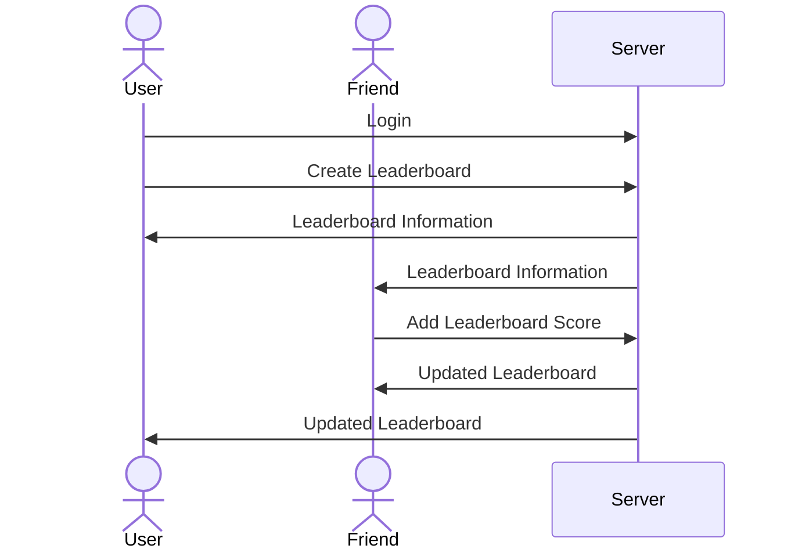

# Boardification

[My Notes](notes.md)

A simple web application to turn anything quantifiable into a contest. Leaderboards can be created, titled, and have scores submitted to them by users. Boards can be opened and closed by users, and can be seen by anyone invited to the same board.

## 🚀 Specification Deliverable

For this deliverable I did the following. I checked the box `[x]` and added a description for things I completed.

- [x] Proper use of Markdown
- [x] A concise and compelling elevator pitch
- [x] Description of key features
- [x] Description of how you will use each technology
- [x] One or more rough sketches of your application. Images must be embedded in this file using Markdown image references.

### Elevator pitch

Have you ever needed a place to keep track of your competition with all your friends? Boardification is the answer. On Boardification, you can create a leader board (or "boardify") for anything you can think of. Most cookies made in a day? Highest streak of wins in Chess? Number of leaderboards won? Boardify has you covered. Just sign up for an account, boardify your contest, and invite your friends to join the board. Now it's easy to see who's #1.

### Design

A diagram showing a basic interaction with the site. A user creates a leaderboard and the server gives both the user and the friend the leaderboard. The friend inputs a score. The server then updates the leaderboard for both the user and the friend.

```mermaid
sequenceDiagram
    actor User
    actor Friend
    User->>Server: Login
    User->>Server: Create Leaderboard
    Server->>User: Leaderboard Information
    Server->>Friend: Leaderboard Information
    Friend->>Server: Add Leaderboard Score
    Server->>Friend: Updated Leaderboard
    Server->>User: Updated Leaderboard
```

### Key features

- Ability to log in securely via HTTPS
- Ability to create leaderboards
- Ability to submit scores to leaderboards
- Ability to invite others with accounts to join leaderboards
- Leaderboards stored and updated

### Technologies

I am going to use the required technologies in the following ways.

- **HTML** - Three different pages will be made with HTML: login, create leaderboard, view leaderboard
- **CSS** - CSS will be used to make viewing the site pleasant with a good color scheme and images where needed.
- **React** - Will be used to allow logging in, creating leaderboards, submitting scores, and other user inputs.
- **Service** - Will be used for:
    - User login and fetching login information
    - Storing and updating created leaderboards and submitted scores
    - Retrieving leaderboard information
- **DB/Login** - Login information, user information, leaderboard data, etc stored in DB.
- **WebSocket** - Leaderboards updated in real time with WebSocket.

## 🚀 AWS deliverable

For this deliverable I did the following. I checked the box `[x]` and added a description for things I completed.

- [x] **Server deployed and accessible with custom domain name** - [My server link](https://boardification.click).

## 🚀 HTML deliverable

For this deliverable I did the following. I checked the box `[x]` and added a description for things I completed.

- [x] **HTML pages** - I created four pages: index.html, which contains the login portal; create.html, which will be the tool for creating leaderboards; myboards.html, which will contain the updating leaderboards the user has created; and about.html, which contains information about the application.
- [x] **Proper HTML element usage** - I followed the conventions I saw in the examples, and I believe it is proper usage.
- [x] **Links** - In the footer of each page, I included a link to my github repository. Additionally, at the top of each page I put a site map, containing links to all the other pages on the site.
- [X] **Text** - Text is displayed on all pages, but it 
- [x] **3rd party API placeholder** - On the about.html page, it has an inspirational quote. Since I can't think of any other good 3rd party API uses yet, for now I have a placeholder for an inspirational quote to help users feel motivated to win their leaderboards.
- [x] **Images** - I designed a rough banner (that just says "boardification") and I applied it to the top of all pages. It is called board_logo.png.
- [x] **Login placeholder** - In index.html, there is a login placeholder, with options for creating an account, or logging in with an email and password.
- [x] **DB data placeholder** - In myboards.html, I made a set of tables that are examples of the leaderboards, which will be a large part of what I will be using the DB for.
- [x] **WebSocket placeholder** - I put in a placeholder for creating leaderboards, and then the plan is for the leaderboards to update whenever someone submits a score to them. Each leader board has a field to submit a score to that board, which will then update for all other users.

## 🚀 CSS deliverable

For this deliverable I did the following. I checked the box `[x]` and added a description for things I completed.

- [x] **Visually appealing colors and layout. No overflowing elements.** - I made sure that elements did not overflow, and I made sure that the colors looked appealing. I went with a nice dark blue, gray, and white color scheme. I think it looks nice.
- [x] **Use of a CSS framework** - I made use of Bootstrap buttons, text-entry boxes, tables, and a navigation bar.
- [x] **All visual elements styled using CSS** - Everything is at least styled with a font and color change via CSS.
- [x] **Responsive to window resizing using flexbox and/or grid display** - I use flexboxes for a lot of things all over the site. At the bottom of each css file, I have an @media section to get rid of the navigation bar if the window is too small.
- [x] **Use of a imported font** - I imported the Roboto Condensed font from Google and applied it to all my pages.
- [x] **Use of different types of selectors including element, class, ID, and pseudo selectors** - I make use of element and class selectors liberally on each page. On the about page, where I am working with more specific paragraphs to format, I use a lot of ID selectors. I also make use of the pseudo selector "hover" on that page, which colors the background of what will be the 3rd party quote supplier black.

## 🚀 React part 1: Routing deliverable

For this deliverable I did the following. I checked the box `[x]` and added a description for things I completed.

- [ ] **Bundled using Vite** - I did not complete this part of the deliverable.
- [ ] **Components** - I did not complete this part of the deliverable.
- [ ] **Router** - I did not complete this part of the deliverable.

## 🚀 React part 2: Reactivity deliverable

For this deliverable I did the following. I checked the box `[x]` and added a description for things I completed.

- [ ] **All functionality implemented or mocked out** - I did not complete this part of the deliverable.
- [ ] **Hooks** - I did not complete this part of the deliverable.

## 🚀 Service deliverable

For this deliverable I did the following. I checked the box `[x]` and added a description for things I completed.

- [ ] **Node.js/Express HTTP service** - I did not complete this part of the deliverable.
- [ ] **Static middleware for frontend** - I did not complete this part of the deliverable.
- [ ] **Calls to third party endpoints** - I did not complete this part of the deliverable.
- [ ] **Backend service endpoints** - I did not complete this part of the deliverable.
- [ ] **Frontend calls service endpoints** - I did not complete this part of the deliverable.
- [ ] **Supports registration, login, logout, and restricted endpoint** - I did not complete this part of the deliverable.

## 🚀 DB deliverable

For this deliverable I did the following. I checked the box `[x]` and added a description for things I completed.

- [ ] **Stores data in MongoDB** - I did not complete this part of the deliverable.
- [ ] **Stores credentials in MongoDB** - I did not complete this part of the deliverable.

## 🚀 WebSocket deliverable

For this deliverable I did the following. I checked the box `[x]` and added a description for things I completed.

- [ ] **Backend listens for WebSocket connection** - I did not complete this part of the deliverable.
- [ ] **Frontend makes WebSocket connection** - I did not complete this part of the deliverable.
- [ ] **Data sent over WebSocket connection** - I did not complete this part of the deliverable.
- [ ] **WebSocket data displayed** - I did not complete this part of the deliverable.
- [ ] **Application is fully functional** - I did not complete this part of the deliverable.
